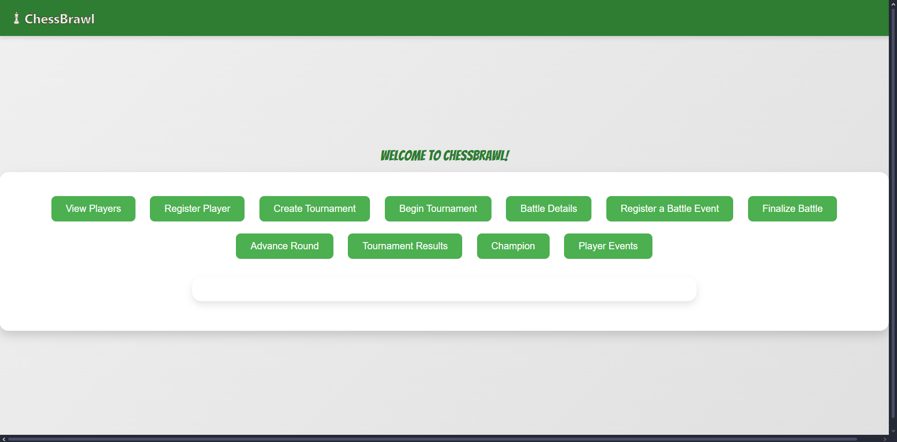

<h1 align="center">Dell - IT Academy: ChessBrawl</h1>

 Thomaz Abrantes de Oliveira Martinelli Silva

---

## How to execute the project APP
<h3>Finding the Main class</h3>

First, you have to look for the "Main.java" which is the main class. You can find the class "Main.java" following this path: 

Dell - IT Academy\Project\CleanArch\ChessBrawl\src\main\java\br\pucrs\thomaz\ChessBrawl\Main.java

<h3>Running the app</h3>
Once you have found the correct class, you can click on the run program button, which is located in the upper right corner (equivalent to the fn + F5 keys or just F5, if you are using Visual Studio Code).

<h3>Finding the app</h3>
Considering that you have already managed to follow all the previous steps, the next step to take is to open a browser of your choice and access: <a href ="http://localhost:8080/">http://localhost:8080/</a>.

You shall see the following interface:

  

<h3>Testing the requests</h3>

Now you can simulate your own chess tournament! You have the following features available via the frontend interface:

<ol>
  <li><strong>View Players</strong> 
    Displays all registered players along with their ranking and tournament points.
  </li>

  <li><strong>Register Player</strong> 
    Prompts the user to input a name, nickname, and ranking (1 to 15000). The player is added to the system and appears in the player list.
  </li>

  <li><strong>Create Tournament</strong> 
    Prompts for a comma-separated list of player nicknames (minimum 4 and maximum 8, even number only). A tournament is created with those players.
  </li>

  <li><strong>Begin Tournament</strong> 
    Prompts for the tournament ID and starts the first round by pairing players into battles.
  </li>

  <li><strong>Battle Details</strong> 
    Shows information about a specific battle. Prompts for tournament ID, round number, and battle index.
  </li>

  <li><strong>Register a Battle Event</strong> 
    Records an in-game event for a specific player in a battle. Prompts for battle ID, player ID, and event type (chosen from a numeric menu):
    <ul>
      <li>1 - ORIGINAL_MOVE</li>
      <li>2 - MISTAKE</li>
      <li>3 - ADVANTAGEOUS_POSITION</li>
      <li>4 - DISRESPECT_TO_OPPONENT</li>
      <li>5 - FURY_ATTACK</li>
    </ul>
    Points and penalties are automatically applied to the player.
  </li>

  <li><strong>Finalize Battle</strong> 
    Prompts for the battle ID. Automatically determines the winner (considering a blitz match in case of a tie) and updates tournament scores.
  </li>

  <li><strong>Advance Round</strong> 
    Prompts for the tournament ID. Proceeds to the next round, if all battles of the current round have been finalized.
  </li>

  <li><strong>Tournament Results</strong> 
    Prompts for the tournament ID. Displays a ranked table with all players, sorted by tournament points and listing event statistics.
  </li>

  <li><strong>Champion</strong> 
    Prompts for the tournament ID. Displays the final champion of the tournament (after all rounds are completed).
  </li>

  <li><strong>Player Events</strong> 
    Prompts for a player ID and displays a chronological list of all in-game events the player participated in.
  </li>
</ol>

Explore each feature to experience a simulated ChessBrawl tournament!

---

